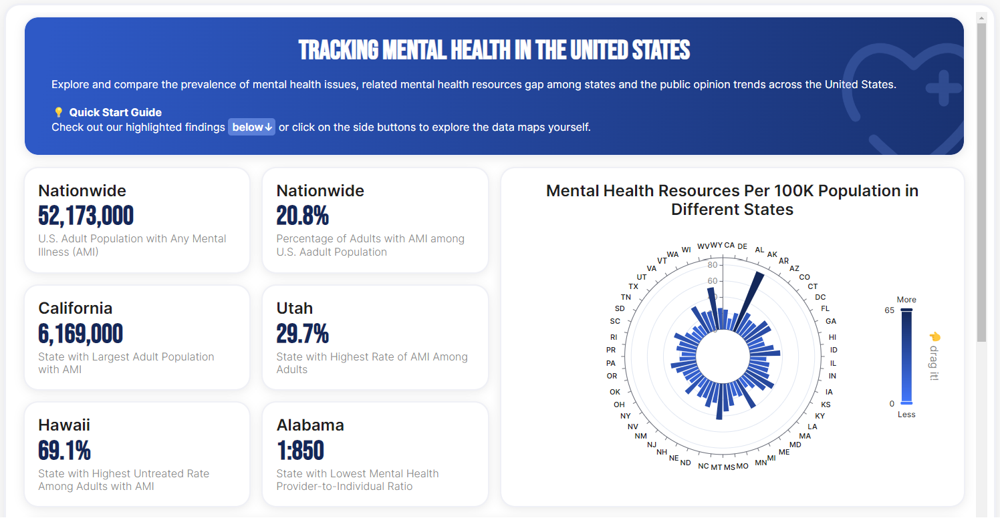
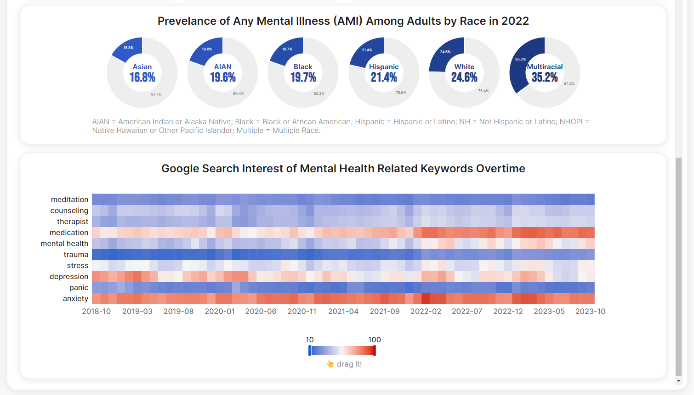
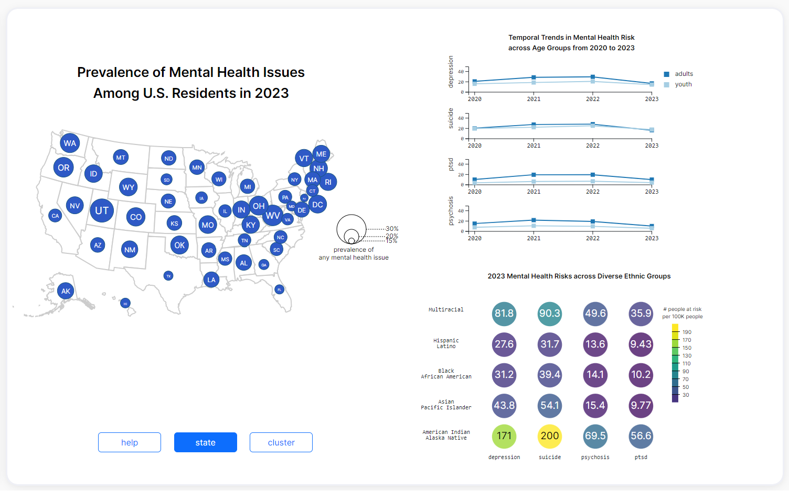
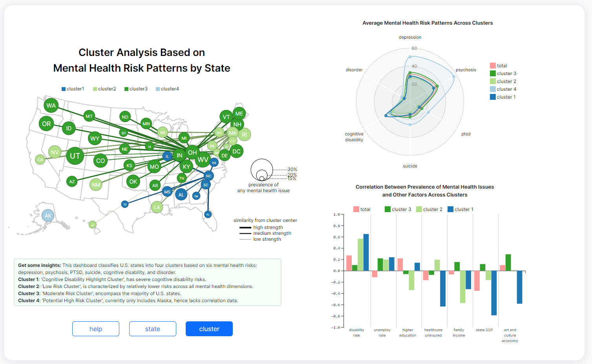
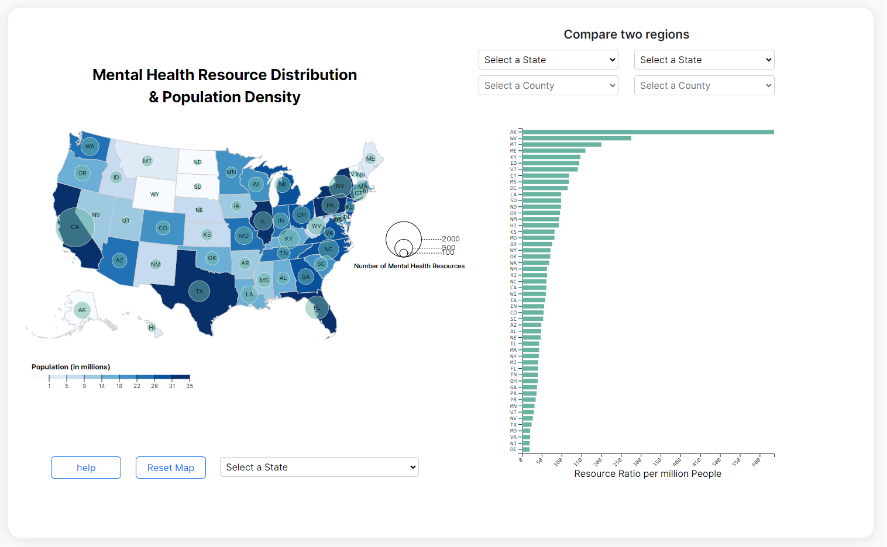
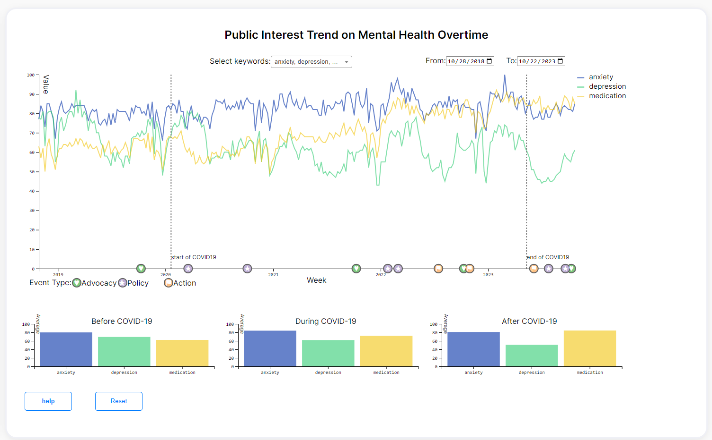

[](https://classroom.github.com/a/aIBftyMV)

# README
# Mental Cares: Tracking Mental Health in the United States

## Introduction
### 👋 Welcome to the Mental Cares Dashboard!

This dashboard is a tool that shows the prevalence and patterns of mental health illness as well as the related health care service based on county-level data among the United States. It also compares the public interests in mental health with the data from Google Search Trends. 

### Who are our users? and What is expected?
`Researchers, policymakers, and journalists` can use this data to:
- Monitor the prevalence of mental health illnesses in the U.S. population by age, race, and region, while exploring the relationship between external factors and the prevalence of mental health issues.

- Evaluate patterns of mental health illnesses, examining the clustering effects of mental health risks across states to establish a comprehensive profile of mental health issues.

- Compare the geographic distribution of mental health services to identify potential inequities in population density and resource distribution.

- Pinpoint the effects of national and state-level public health policies and initiatives on healthcare utilization.

- Observe the impact of natural phenomena, such as the COVID-19 pandemic, on public interest in mental health-related affairs.

### Why is it original?
The dashboard's originality lies in its `interactive navigation`, offering `dynamic exploration` and `personalized engagement`. Features like tooltips and multiple selections empower users for detailed insights, enhancing the overall experience. A key innovation is the `integration of hierarchical clustering and network graph visualization`, providing a flexible and interpretable way to explore relationships between mental health patterns and states. This approach captures intricate state connections, offering a unique perspective on dynamic visualization. 
The `dual-layered method` overlays proportional symbol resource maps onto population density choropleth maps for simultaneous assessment. Additionally, the dashboard introduces `diverse visualization techniques`, including proportional symbol maps, choropleth maps, small multiple line charts, heatmaps, radar charts, and grouped bar charts, ensuring a comprehensive understanding of mental health patterns.

Just get started navigating our dashboard. We hope you can gain valuable insights into mental health issues, contributing to a more informed and proactive approach in addressing public health concerns.

## Getting Started
### Access Dashboard Locally
To view our dashboard, follow these steps:
1. Clone this repository to your local machine.
2. Install dependencies and run visualization.
    ```bash
    npm install    #install js libraries
    npm run serve  #starts server on port 2000
    ```
3. The dashboard's homepage will be displayed on `index.html`.

OR
1. Clone this repository to your local machine.
2. Install dependencies.
    ```bash
    npm install    #install js libraries
    ```
3. Install `Live Server` Extension.
4. Right-click the dashboard's homepage `main.html` and select `Open with Live Server` from the context menu.
5. Browser window will open, displaying the dashboard homepage.

### Access Deployed Dashboard
We have deployed and published our dashboard as a static site on Render. Render, a cloud platform, ensures the stable and secure operation of our dashboard and provides our users with a better experience. During deployment, we leverage Render for seamless building and deployment directly from Git.

To access our deployed dshabord, users can access this link: [Mental Cares](https://mental-cares-tracking-mental-health-in.onrender.com/). 

### Explore More About Our Work
- Paper: [Blank Github]() or `main.tex` in [Overleaf](https://www.overleaf.com/read/sjfpjcrfqxdw#e25259)
- Demo Video: [Youtube Video](https://youtu.be/_165LIIeisM)
- Presentation Slide: [Google Slide](https://docs.google.com/presentation/d/17hBKbxC55VdInrTd3L1PufKS8QlfhXtZ75sabVx2vAA/edit?usp=sharing)
- Report:  [Github](./docs/Report_Emotions%20Team.pdf) or [Google Document](https://docs.google.com/document/d/1sGOoGS2AIb3QjsH5W0rVbfeNLo10WRxMGrHTnGJxDxg/edit?usp=sharing)
- Design File: [Figma](https://www.figma.com/file/ZA3XXiydpOgftdh5IVLaTT/Mental-Health-Tracker)
- Notebooks: [Notebook](./assets/notebook/) (See below for details)

## Dashboard Design
### Feature and Highlights
- Homepage

    Users can leverage the `Homepage` for an interactive overview of the entire dashboard. They can 
    1. Get comprehensive KPIs for mental health illness across the United States
    2. Address mental health resource inequality among states using polar bar chart
    3. Assess risks among different demographic groups using donut chart
    4. Explore the temporal trends in public interest using heat map
    
    

   
- Explore States

    Users can use `Explore States` page to understand the mental health illness landscape and risk at state and cluster levels. They can
    1. Navigate and gain an overview of mental health illness across states using a proportional symbol map. Obtain a detailed snapshot of mental health conditions in a specific state through interactive operations.
    2. Compare the risk of mental health illness across age groups, timeline, and mental issues using small multilinear plots.
    3. Compare the risk of mental health illness across races using a heatmap.
    4. Navigate and gain insights into mental health clustering effects across states with the proportional symbol map. Use multi-selection for further comparative analysis.
    5. Compare mental health risk patterns across clusters using a radar chart.
    6. Extract insights from the correlation between prevalence and macro-level factors across clusters.
    
    


- Health Resources

    Users can use `Health Resources` page to focus on the distribution and density of mental health resources across states and counties. They can
    1. Evaluate mental health resources and population density, identifying inequalities through a dual-layered map with a proportional symbol map overlaid on a choropleth map.
    2. Zoom into specific states using the selector to display resources and population data for the counties within that state.
    3. Conduct a comparative analysis of resource density between two states or counties using a bar chart.
    

- Public Interest Timeline
    Users can use `Timeline` page to explore the search interest timeline of the U.S. public in mental health-related keywords. They can
    1. Directly access the Top 3 most popular mental health-related keywords
    2. Compare temporal patterns across various mental health keywords within the specified time range using line chart
    3. Obtain important policies, advocacies, and actions on mental health using the timeline
    3. Compare average search interest of different mental health-related keyworkds before, during and after the pandemic using bar graphs
    

### Wireframe Design
See our wireframe design in [Figma](https://www.figma.com/file/ZA3XXiydpOgftdh5IVLaTT/Mental-Health-Tracker).

- Responsive design

    Users can enjoy a consistent and optimal user experience across various devices, ensuring that the content is always accessible to a broader audience.

- Consistent color palette

    Users can experience a cohesive visual experience with a consistent color palette throughout the platform, fostering a unified and aesthetically pleasing design across all elements.


## Dashboard Development
### Tools and Usage
- `Figma` for Web Design
- `D3.js` for Visualization
- `echarts.js` for Visualization
- `Jquery` for Controls
- `Bootstrap` for CSS
- `Render` for Deployment

### Data Source
- National Survey on Drug Use and Health: [Source Link](https://www.samhsa.gov/data/data-we-collect/nsduh-national-survey-drug-use-and-health)
- Mental Health America: [Source Link](https://mhanational.org/issues/2023/mental-health-america-all-data)
- Health Resources & Services Administration: [Source Link](https://data.hrsa.gov/tools/shortage-area/hpsa-find)
- Google Trends: [Source Link](https://trends.google.com/trends/)

### Notebook
We employ notebooks to fetch, preprocess, analyze, and model data.
- [fetch_mha.ipynb](./assets/notebook/fetch_mha.ipynb): fetch mental health illnesse risk data
- [analysis_model_states.ipynb](./assets/notebook/analysis_model_states.ipynb): data analysis, clustering model and output
- [preprocessing_mha.ipynb](./assets/notebook/preprocessing_mha.ipynb): preprocess MHA data
- [preprocessing_mha_report.ipynb](./assets/notebook/preprocessing_mha_report.ipynb): preprocess MHA report
- [pytrend.ipynb](./assets/notebook/pytrend.ipynb): collect google trend data and preprocess
- [county_resource_extract.ipynb](./assets/notebook/county_resource_extract.ipynb): extract resource data for each county
- [state_county_pop.ipynb](./assets/notebook/state_county_pop.ipynb): match population to states and counties
- [id_state_county_pop.ipynb](./assets/notebook/id_state_county_pop.ipynb): match id to states and counties
- [find_coordinates.ipynb](./assets/notebook/find_coordinates.ipynb): find coordinates for each resource site (the coordinates data are not used, but the resource dataset are used in next notebook)
- [county_state_resoure.ipynb](./assets/notebook/county_state_resoure.ipynb): summary the resources amount for each county and convert to the format for proportional symbol map

### HTML files
Our HTML files include:
- [main.html](./main.html): web base
- [about.html](./assets/html/about.html): about page
- [home.html](./assets/html/home.html): homepage
- [about.html](./assets/html/mental_resource.html): about page
- [mental_states.html](./assets/html/mental_states.html): explore states page
- [mental_trend.html](./assets/html/mental_trend.html): timeline page
